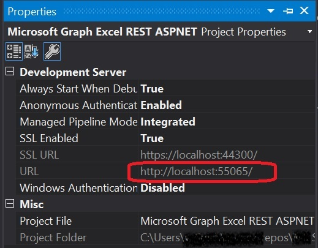
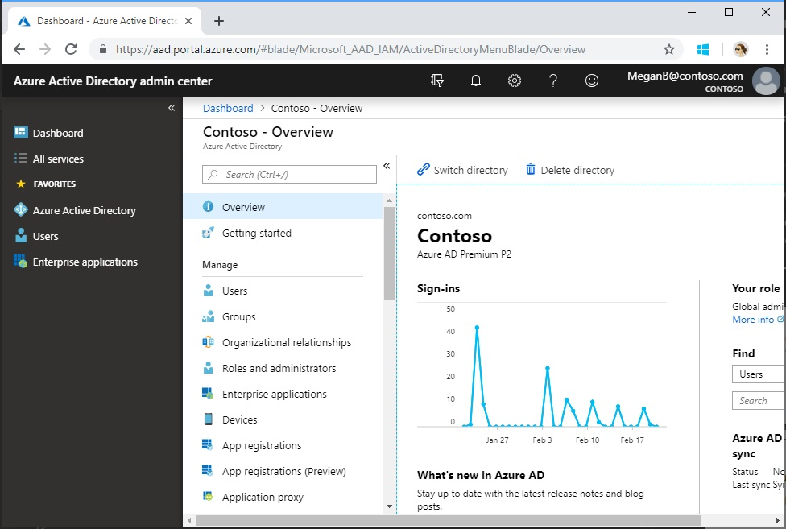
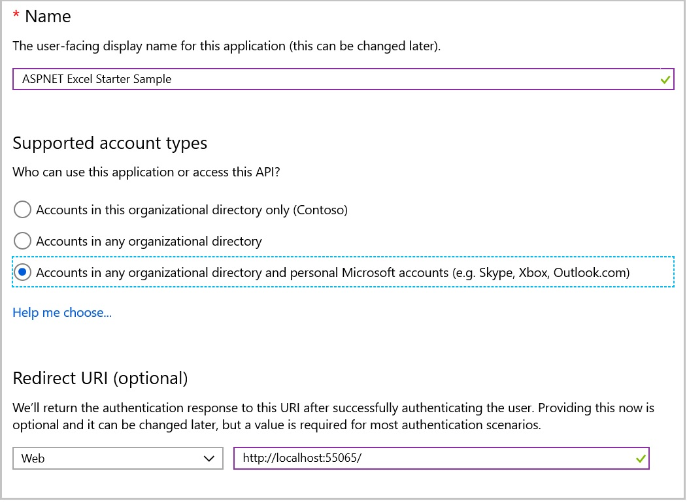
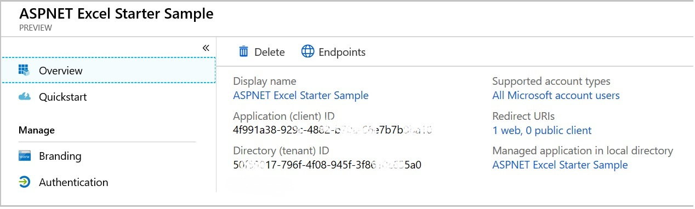
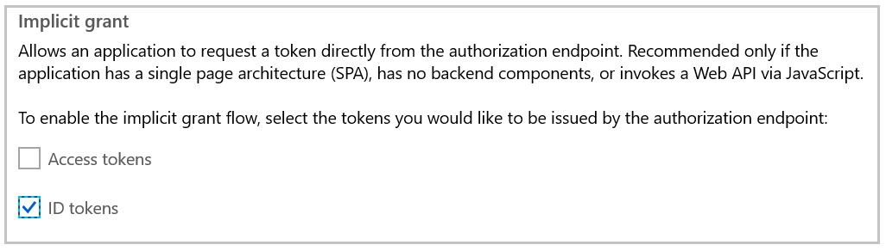
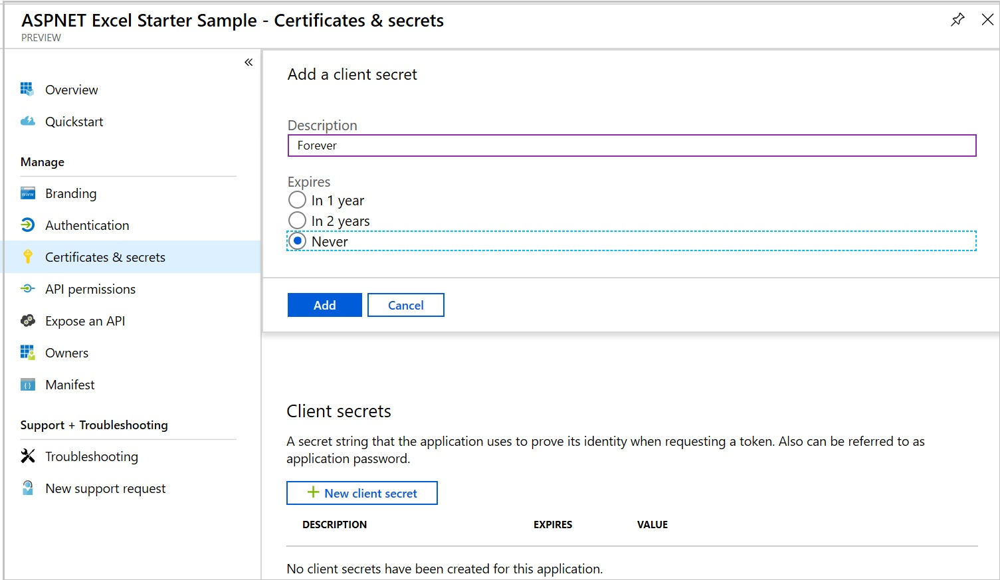
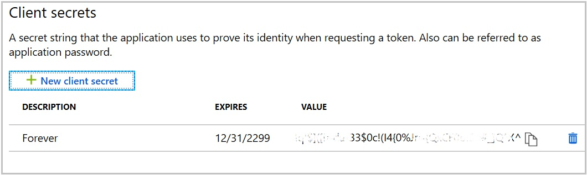

# Microsoft Graph Excel Starter Sample for ASP.NET 4.6

## IMPORTANT

**This project is being archived and replaced with the [Build ASP.NET MVC apps with the Microsoft Graph SDK training](https://github.com/microsoftgraph/msgraph-training-aspnetmvcapp). As part of the archival process, we're closing all open issues and pull requests.**

**You can continue to use this sample "as-is", but it won't be maintained moving forward. We apologize for any inconvenience.**

## Table of contents

* [Prerequisites](#prerequisites)
* [Register the application](#register-the-application)
* [Build and run the sample](#build-and-run-the-sample)
* [Questions and comments](#questions-and-comments)
* [Contributing](#contributing)
* [Additional resources](#additional-resources)

This sample shows how to connect an ASP.NET 4.6 MVC web app to a Microsoft work or school (Azure Active Directory) or personal (Microsoft) account using the Microsoft Graph API to retrieve a user's profile information and upload that information to an Excel workbook. It uses the [Microsoft Graph .NET Client Library](https://github.com/microsoftgraph/msgraph-sdk-dotnet) to work with data returned by Microsoft Graph. 

In addition, the sample uses the [Microsoft Authentication Library (MSAL)](https://www.nuget.org/packages/Microsoft.Identity.Client/) for authentication. The MSAL SDK provides features for working with the [Azure AD v2.0 endpoint](https://azure.microsoft.com/en-us/documentation/articles/active-directory-appmodel-v2-overview), which enables developers to write a single code flow that handles authentication for both work or school (Azure Active Directory) and personal (Microsoft) accounts.

## Important Note about the MSAL Preview

This library is suitable for use in a production environment. We provide the same production level support for this library as we do our current production libraries. During the preview we may make changes to the API, internal cache format, and other mechanisms of this library, which you will be required to take along with bug fixes or feature improvements. This may impact your application. For instance, a change to the cache format may impact your users, such as requiring them to sign in again. An API change may require you to update your code. When we provide the General Availability release we will require you to update to the General Availability version within six months, as applications written using a preview version of library may no longer work.

## Prerequisites

This sample requires the following:  

  * [Visual Studio](https://www.visualstudio.com/en-us/downloads) 
  * Either a [Microsoft account](https://www.outlook.com) or [Office 365 for business account](https://msdn.microsoft.com/en-us/office/office365/howto/setup-development-environment#bk_Office365Account). You can sign up for [an Office 365 Developer subscription](https://msdn.microsoft.com/en-us/office/office365/howto/setup-development-environment#bk_Office365Account) that includes the resources that you need to start building Office 365 apps.
  * Upload the **demo.xlsx** file in the root of this repository to the root folder of your OneDrive account. This file contains an empty table with two columns.
  
## Register the application

1. Determine your ASP.NET app's URL. In Visual Studio's Solution Explorer, select the **Microsoft Graph Excel REST ASPNET** project. In the **Properties** window, find the value of **URL**. Copy this value.

    

1. Open a browser and navigate to the [Azure Active Directory admin center](https://aad.portal.azure.com). Login using a **personal account** (aka: Microsoft Account) or **Work or School Account**.

1. Select **Azure Active Directory** in the left-hand navigation, then select **App registrations (Preview)** under **Manage**.

    

1. Select **New registration**. On the **Register an application** page, set the values as follows.

    - Set **Name** to `ASPNET Excel Starter Sample`.
    - Set **Supported account types** to **Accounts in any organizational directory and personal Microsoft accounts**.
    - Under **Redirect URI**, set the first drop-down to `Web` and set the value to the ASP.NET app URL you copied in step 1.

    

1. Choose **Register**. On the **ASPNET Excel Starter Sample** page, copy the value of the **Application (client) ID** and save it, you will need it in the next step.

    

1. Select **Authentication** under **Manage**. Locate the **Implicit grant** section and enable **ID tokens**. Choose **Save**.

    

1. Select **Certificates & secrets** under **Manage**. Select the **New client secret** button. Enter a value in **Description** and select one of the options for **Expires** and choose **Add**.

    

1. Copy the client secret value before you leave this page. You will need it in the next step.

    > [!IMPORTANT]
    > This client secret is never shown again, so make sure you copy it now.

    

## Build and run the sample

1. Download or clone the Microsoft Graph Excel Starter Sample for ASP.NET 4.6.

2. Open the sample solution in Visual Studio.

3. In the Web.config file in the root directory, replace the **ida:AppId** and **ida:AppSecret** placeholder values with the application ID and password that you copied during app registration.

4. Press F5 to build and run the sample. This will restore NuGet package dependencies and open the app.

   >If you see any errors while installing packages, make sure the local path where you placed the solution is not too long/deep. Moving the solution closer to the root of your drive resolves this issue.

5. Sign in with your personal or work or school account and grant the requested permissions.

6. Choose the **Get email address** button. When the operation completes, the name and email address of the signed-in user are displayed on the page.

7. Choose the **Upload to Excel** button. The application creates a new row in the demo.xlsx workbook and adds the user name and email address to that row. A Success message is displayed below the button.

## Questions and comments

We'd love to get your feedback about this sample. You can send us your questions and suggestions in the [Issues](https://github.com/microsoftgraph/aspnet-excelstarter-sample/issues) section of this repository.

Your feedback is important to us. Connect with us on [Stack Overflow](http://stackoverflow.com/questions/tagged/microsoftgraph). Tag your questions with [MicrosoftGraph].

## Contributing ##

If you'd like to contribute to this sample, see [CONTRIBUTING.md](CONTRIBUTING.md).

This project has adopted the [Microsoft Open Source Code of Conduct](https://opensource.microsoft.com/codeofconduct/). For more information see the [Code of Conduct FAQ](https://opensource.microsoft.com/codeofconduct/faq/) or contact [opencode@microsoft.com](mailto:opencode@microsoft.com) with any additional questions or comments.

## Additional resources

- [Other Microsoft Graph Connect samples](https://github.com/MicrosoftGraph?utf8=%E2%9C%93&query=-Connect)
- [Microsoft Graph overview](http://graph.microsoft.io)
- [Office developer code samples](http://dev.office.com/code-samples)
- [Office dev center](http://dev.office.com/)

## Copyright
Copyright (c) 2019 Microsoft. All rights reserved.

